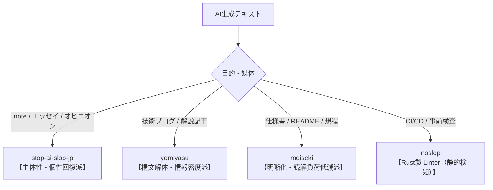

# Awesome Japanese Anti-Slop [](https://awesome.re)

> 日本語特有の「AI臭・AIスロップ（AI Slop）」を検知・排除・推敲するためのツール、Agent Skill、プロンプト、知見のキュレーションリスト。  
> Curated list of awesome tools, agent skills, linters, and guides for eliminating AI-generated "slop" in Japanese text.

---

## 📖 目次 (Table of Contents)

- [AIスロップ（AI Slop）とは](#aiスロップai-slopとは)
- [なぜ日本語特有の対策が必要なのか](#なぜ日本語特有の対策が必要なのか)
- [日本語脱スロップの3大流派](#日本語脱スロップの3大流派)
- [ツール・リポジトリ一覧](#ツールリポジトリ一覧)
  - [Agent Skills / プラグイン](#agent-skills--プラグイン)
  - [Linters / 静的解析ツール](#linters--静的解析ツール)
  - [プロンプト・ガイドライン](#プロンプトガイドライン)
  - [研究・分析リソース](#研究分析リソース)
- [A/Bテスト・ベンチマーク](#abテストベンチマーク)
- [コントリビューション](#コントリビューション)
- [ライセンス](#ライセンス)

---

## 🧐 AIスロップ（AI Slop）とは

**AIスロップ（AI Slop）** とは、生成AIによって大量に作成された**「一見整っているが、中身が薄く主体性のない低品質コンテンツ」**を指す言葉です（2025年、米メリアム・ウェブスター辞書の「Word of the Year」選出）。

---

## 🇯🇵 なぜ日本語特有の対策が必要なのか

英語圏でデファクトとなっている対策（`hardikpandya/stop-slop` 等）を直訳しても、日本語のスロップは解消しません。言語の急所が根本的に異なるためです。

| 観点 | 英語のAI Slop（特徴と対策） | 日本語のAI Slop（特徴と対策） |
| :--- | :--- | :--- |
| **語彙・修辞** | `delve`, `tapestry`, `testament`, `crucial` などの過剰頻出語 | 「〜の羅針盤」「架け橋」「起爆剤」「新たな地平」「〜が教えてくれること」などの大言壮語・紋切り型比喩 |
| **文法・構文** | 能動態への変換、副詞の削除 | **主語の欠落による責任の不在**、修飾節が長すぎる複文、主述のねじれ |
| **トーン・文末** | Sycophancy（過剰な同調・へつらい）の排除 | **語尾の単調さ**（です/ますの連続）、**事なかれ主義の両論併記**（「〜の一方で、〜も重要と言えるでしょう」） |
| **装飾記号** | 不要なボールド強調や箇条書きの多用 | 意味のないカギ括弧「」、過剰な太字、Markdown記号の残骸 |

---

## 🏛 日本語脱スロップの3大流派

目的や媒体に応じて、最適なアプローチが異なります。



| 流派 | 代表ツール | 哲学 | 最適な媒体 |
| :--- | :--- | :--- | :--- |
| **主体性・個性回復派** | `stop-ai-slop-jp` | AI臭＝書き手の不在。一般論をやめ、「自分はこう考える」と一人称の責任を立たせる。 | note、Zennエッセイ、提案書の動機 |
| **構文解体・情報密度派** | `yomiyasu` | AIが作った文の骨組み（SVOCM）をバラし、短文と適切な接続詞でテンポ良く組み直す。 | 技術ブログ、Qiita、解説記事 |
| **明晰化・読解負荷低減派** | `meiseki` | 個性は不要。二重否定や曖昧な比喩を徹底的に削ぎ落とし、誰が読んでも誤解のない中立文にする。 | 仕様書、README、社内マニュアル |

---

## 🛠 ツール・リポジトリ一覧

### Agent Skills / プラグイン

AIエージェント（Claude Code、Cursor、Antigravity、Codex等）に導入して推敲を実行するスキル群。

- **[iKora128/stop-ai-slop-jp](https://github.com/iKora128/stop-ai-slop-jp)** - 英語版 `stop-slop` を日本語に最適化したClaude Skill。大言壮語な表現や無難な両論併記を排除し、書き手の一人称と主張を立たせる。
- **[nanaism/yomiyasu](https://github.com/nanaism/yomiyasu)** - 構文構造（SVOCM）レベルで文章を解体・再構築するAgent Skill。一文40〜60字への適正化と冗長な接続詞の削減を得意とする。
  ```bash
  npx skills add nanaism/yomiyasu
  ```
- **[bamboo-nova/meiseki](https://github.com/bamboo-nova/meiseki)** - 技術文書の読解負荷を最小化するAgent Skill / Claude Plugin。構文をほどき、中立かつ明晰な表現に変換する。
  ```bash
  npx skills add https://github.com/bamboo-nova/meiseki --skill meiseki
  ```

### Linters / 静的解析ツール

LLMの推論コストをかけずに、ルールベースで機械的にAI臭を検知するCLIツール。

- **[owayo/noslop](https://github.com/owayo/noslop)** - 日本語文章やコードコメント内のAI特有の定型句・単調なリズムを検出するRust製Linter。Pre-commitやCI/CDへの組み込みに最適。

### プロンプト・ガイドライン

ChatGPTやClaude等のWebインターフェースで即座に使えるプロンプトテンプレート。

- **即効脱スロップ・プロンプト制約**:
  ```markdown
  以下の制約を厳守して文章をリライトしてください：
  1. 【主体の明示】: 一般論や伝聞（〜と言える、〜と考えられる）を禁止し、書き手の立場から言い切る。
  2. 【禁止語彙】: 「羅針盤」「架け橋」「起爆剤」「新たな地平」「重要です」「不可欠」等の紋切り型の比喩・強調表現を使わない。
  3. 【構造の簡素化】: 導入の前置きや末尾のまとめ（いかがでしたでしょうか等）を削除し、本題から開始する。
  4. 【リズムの調整】: 短文と複文を混ぜ、体言止めや読点の位置を工夫して機械的な均一感を崩す。
  5. 【具体性の付与】: 抽象的な解説には、具体的な数値・失敗談・制約条件を最低1つ含める。
  ```

### 研究・分析リソース

- **[kenimo49/excess-vocabulary-japanese-ai](https://github.com/kenimo49/excess-vocabulary-japanese-ai)** - 日本語LLMが統計的に過剰出力しがちな語彙（Excess Vocabulary）のモデル別分析プロジェクト。
- **[AI臭を消すClaude Skillsを作った（stop-ai-slop-jp）](https://zenn.dev/genshi_ai/articles/88f62861a953c1)** - Zennでの解説記事。

---

## 📊 A/Bテスト・ベンチマーク

同一のAIスロップ文章に対する各流派のリライト比較サンプル。

詳細は [benchmark/BENCHMARK_JA.md](benchmark/BENCHMARK_JA.md) を参照。

### サンプル要約（技術解説の場合）

- **【入力（AIスロップ）】**:
  > Dockerはまさに開発現場における「変革の羅針盤」であり、開発と運用の架け橋となる不可欠な存在と言えるでしょう。〜状況に応じた柔軟なアプローチが求められます。〜新たな地平なのです。
- **【stop-ai-slop-jp（主体性）】**:
  > 私は開発現場でDockerを標準化すべきだと考えている。従来の仮想マシンに比べて軽量で起動が圧倒的に速く、「手元では動いたのに本番で動かない」という不毛な環境差異を確実に潰せるからだ。
- **【yomiyasu（構文解体）】**:
  > Dockerをはじめとするコンテナ技術は、現代の開発現場で事実上の標準です。従来の仮想マシンと比べて軽量で、起動も高速です。導入初期には学習コストがかかりますが、環境差異をなくせる利点は極めて強力です。
- **【meiseki（明晰化）】**:
  > コンテナ技術（Docker等）は、従来の仮想マシンと比較して軽量かつ高速に起動します。主な利点は、開発環境と本番環境の差異を排除できる点です。一方、導入には学習コストと運用設計を伴います。

---

## 🤝 コントリビューション

新しいツールの推薦やプロンプトの改善提案を歓迎します！  
詳細は [CONTRIBUTING.md](CONTRIBUTING.md) をご覧ください。

---

## 📄 ライセンス

[](https://creativecommons.org/publicdomain/zero/1.0/)

This work is licensed under [CC0 1.0 Universal](LICENSE).
